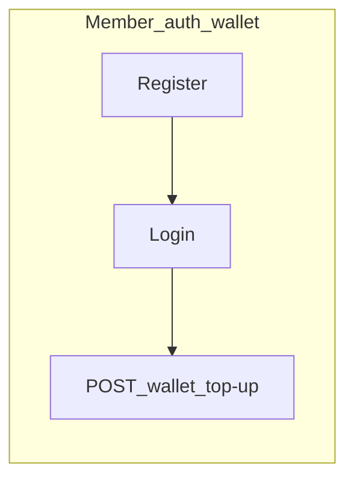
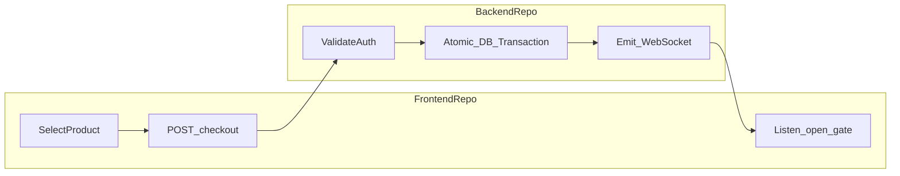
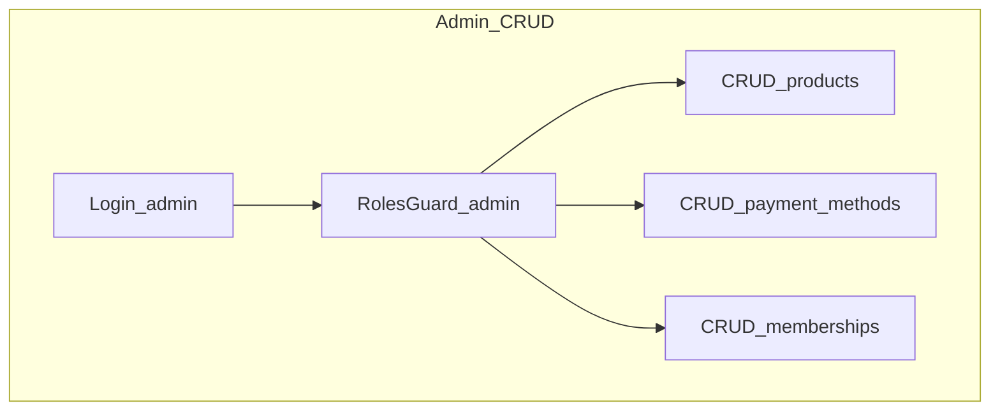
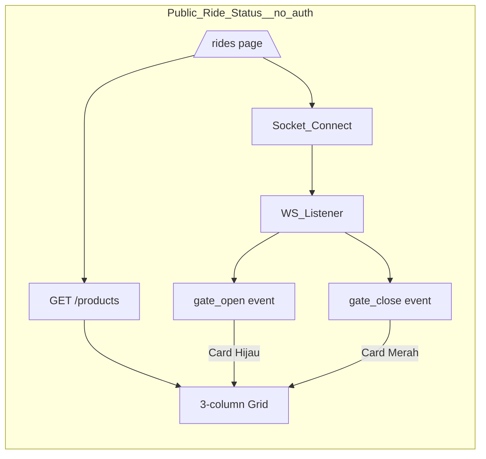

# Application Flow

## User Flow









```mermaid
flowchart TD
  subgraph paymentChange [Change_Payment_Method]
    viewTx[GET /transactions/:id]
    checkStatus{Check status}
    isPending{status = pending?}
    isFailed{status = failed?}
    showChangeBtn[Show "Ganti Metode"]
    selectMethod[Select new payment method]
    callAPI[PATCH /transactions/:id/payment-method]
    showCancelBtn[Show "Cancel" button]
    cancelTx[POST /transactions/:id/cancel]
  end
  viewTx --> checkStatus
  checkStatus --> isPending
  checkStatus --> isFailed
  isPending -->|"yes"| showChangeBtn
  isFailed -->|"yes"| showChangeBtn
  showChangeBtn --> selectMethod
  selectMethod --> callAPI
  isPending -->|"yes"| showCancelBtn
  showCancelBtn --> cancelTx
```

---

## Alur Penggunaan Wahana (Flow Pembelian & IoT Trigger)

### Flow Pembelian Wahana

```
Pengunjung berada di area EAL
         │
         ▼
┌─────────────────────────────────┐
│ 1. Pemilihan & Pembayaran      │
│    - Buka aplikasi             │
│    - Pilih tiket Cable Car     │
│    - Pilih metode E-Wallet     │
└─────────────────────────────────┘
         │
         ▼
┌─────────────────────────────────┐
│ 2. Transaksi Database          │
│    (Atomic Transaction)        │
│    - Cek saldo E-Wallet        │
│    - Potong saldo E-Wallet     │
│    - Catat transaksi           │
│    - Tambahkan poin membership │
│    - Update QR Code (Akses)    │
└─────────────────────────────────┘
         │
         ▼
┌─────────────────────────────────┐
│ 3. Eksekusi di Lapangan (IoT)  │
│    - Pengunjung scan QR di gate │
│    - Backend validasi tiket    │
│    - Trigger WebSocket         │
│    - gate_open → palang buka   │
│    - Kuota wahana hangus       │
└─────────────────────────────────┘
```

### WebSocket Event Mapping

| Event Name       | Payload                                   | Trigger                   |
| ---------------- | ----------------------------------------- | ------------------------- |
| `gate_open`      | `{ userId, productId, transactionId }`    | QR code valid di gate IoT |
| `ticket_scanned` | `{ transactionId, productId, timestamp }` | Gate scanner membaca QR   |
| `quota_exceeded` | `{ productId, remaining }`                | Kapasitas wahana penuh    |

---

## Skema Gagal Bayar (Change Payment Method)

Jika transaksi gagal (timeout, bank down), pengunjung dapat **ganti metode pembayaran** pada invoice yang sama tanpa harus buat ulang keranjang.

### Flow

```
Checkout dimulai dengan Metode A (Virtual Account)
         │
         ▼
┌─────────────────────────────────┐
│ Payment Gateway Call           │
│ ❌ Timeout / Bank Down         │
└─────────────────────────────────┘
         │
         ▼
┌─────────────────────────────────┐
│ "Ganti Metode Pembayaran"      │
│ - QRIS                         │
│ - E-Wallet                     │
└─────────────────────────────────┘
         │
         ▼
PATCH /transactions/:id/payment-method
         │
         ▼
Invoice diperbarui, amount sama
```